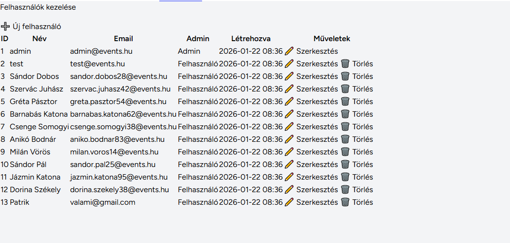
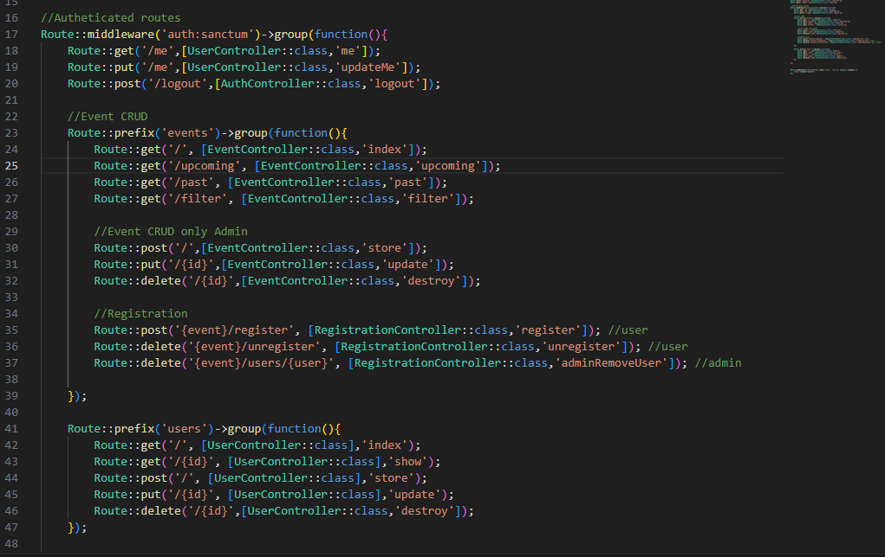
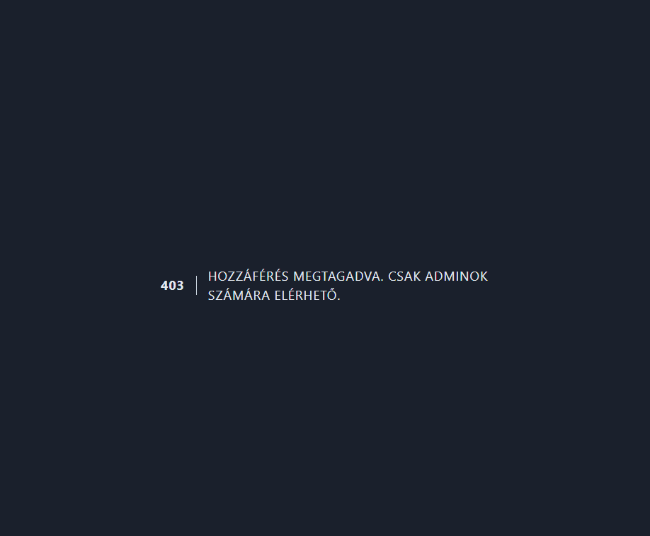

# Admin vs Felhasználó Jogosultságok

## Áttekintés

Az alkalmazás kétszintű jogosultsági rendszert használ:
- **Admin felhasználók**: Teljes hozzáférés minden funkcióhoz
- **Sima felhasználók**: Csak olvasási jogosultság

## Jogosultságok Részletezése

### Admin Felhasználók (`is_admin = true`)

Admin felhasználók teljes CRUD (Create, Read, Update, Delete) jogosultsággal rendelkeznek:

#### ✅ Engedélyezett Műveletek:
- ✓ Események megtekintése
- ✓ Események létrehozása
- ✓ Események szerkesztése
- ✓ Események törlése
- ✓ Felhasználók megtekintése
- ✓ Felhasználók létrehozása
- ✓ Felhasználók szerkesztése
- ✓ Felhasználók törlése (kivéve saját fiók)

#### Nézet Admin Számára:



**Admin nézetben látható:**
- ➕ "Új felhasználó" gomb
- ✏️ "Szerkesztés" gomb minden felhasználónál
- 🗑️ "Törlés" gomb minden felhasználónál (kivéve saját)

### Sima Felhasználók (`is_admin = false`)

Sima felhasználók csak olvasási jogosultsággal rendelkeznek:

#### ✅ Engedélyezett Műveletek:
- ✓ Események megtekintése (csak lista)
- ✓ Felhasználók megtekintése (csak lista)

#### ❌ Tiltott Műveletek:
- ✗ Események létrehozása
- ✗ Események szerkesztése
- ✗ Események törlése
- ✗ Felhasználók létrehozása
- ✗ Felhasználók szerkesztése
- ✗ Felhasználók törlése

#### Nézet Sima Felhasználó Számára:


**Sima felhasználó nézetben:**
- ❌ NINCS "Új felhasználó" gomb
- ❌ NINCS "Szerkesztés" gomb
- ❌ NINCS "Törlés" gomb
- ✓ Csak a lista megtekintése lehetséges

## Technikai Implementáció

### 1. Route Szintű Védelem

#### Web Route-ok (web.php)

```php
// web.php

// Olvasási jogosultság mindenki számára (bejelentkezve)
Route::middleware(['auth'])->prefix('admin')->name('admin.')->group(function() {
    Route::get('events', [EventController::class, 'index'])->name('events.index');
    Route::get('users', [UserController::class, 'index'])->name('users.index');
});

// Módosítási jogosultság csak adminoknak
Route::middleware(['auth', 'admin'])->prefix('admin')->name('admin.')->group(function() {
    Route::get('events/create', [EventController::class, 'create'])->name('events.create');
    Route::post('events', [EventController::class, 'store'])->name('events.store');
    Route::get('events/{event}/edit', [EventController::class, 'edit'])->name('events.edit');
    Route::put('events/{event}', [EventController::class, 'update'])->name('events.update');
    Route::delete('events/{event}', [EventController::class, 'destroy'])->name('events.destroy');
    
    // ... ugyanez users-re is
});
```

#### API Route-ok (api.php)



Az API route-ok Sanctum autentikációt használnak és külön jogosultság kezelést implementálnak:

- **Event CRUD**: Események lekérése, szűrés, létrehozás (admin), módosítás (admin), törlés (admin)
- **Registration**: Regisztráció eseményekre, leiratkozás, admin eltávolítás
- **User CRUD**: Felhasználók kezelése API-n keresztül

### 2. View Szintű Védelem

A blade template-ekben dinamikusan elrejtjük a műveleteket:

```php
@if(auth()->user()->is_admin)
    <a href="{{ route('admin.users.create') }}" class="btn btn-primary mb-3">
        ➕ Új felhasználó
    </a>
@endif
```

```php
@if(auth()->user()->is_admin)
    <td>
        <a href="{{ route('admin.users.edit', $user) }}" class="btn btn-sm btn-warning">
            ✏️ Szerkesztés
        </a>
        
        <form action="{{ route('admin.users.destroy', $user) }}" method="POST">
            @csrf
            @method('DELETE')
            <button class="btn btn-sm btn-danger">🗑️ Törlés</button>
        </form>
    </td>
@endif
```

### 3. Middleware Védelem

Az `AdminMiddleware` ellenőrzi a jogosultságot:

```php
// app/Http/Middleware/AdminMiddleware.php
public function handle(Request $request, Closure $next)
{
    if (!auth()->check() || !auth()->user()->is_admin) {
        abort(403, 'Csak adminok számára elérhető.');
    }
    
    return $next($request);
}
```

Regisztrálva a `bootstrap/app.php`-ban:

```php
->withMiddleware(function (Middleware $middleware) {
    $middleware->alias([
        'admin' => \App\Http\Middleware\AdminMiddleware::class,
    ]);
})
```

### 4. Navigációs Menü

Minden bejelentkezett felhasználó látja a menüpontokat:

```php
// resources/views/layouts/navigation.blade.php
<x-nav-link :href="route('admin.events.index')">
    Események
</x-nav-link>

<x-nav-link :href="route('admin.users.index')">
    Felhasználók
</x-nav-link>
```

**NINCS** `@if(auth()->user()->is_admin)` feltétel - mindenki látja!

## Vizuális Összehasonlítás

| Funkció | Admin | Sima Felhasználó |
|---------|-------|------------------|
| Események megtekintése | ✅ | ✅ |
| Események létrehozása | ✅ | ❌ |
| Események szerkesztése | ✅ | ❌ |
| Események törlése | ✅ | ❌ |
| Felhasználók megtekintése | ✅ | ✅ |
| Felhasználók létrehozása | ✅ | ❌ |
| Felhasználók szerkesztése | ✅ | ❌ |
| Felhasználók törlése | ✅ | ❌ |
| "Új..." gombok | Látható | Rejtett |
| "Szerkesztés" gombok | Látható | Rejtett |
| "Törlés" gombok | Látható | Rejtett |

## Biztonsági Szempontok

### Többrétegű Védelem

Az alkalmazás háromszintű védelmet alkalmaz:

1. **Route szint**: Middleware blokkolja a nem engedélyezett útvonalakat
2. **View szint**: UI elemek rejtése a nem jogosult felhasználók elől
3. **Controller szint**: Implicit védelem a route middleware által

### Miért Fontos?

**❌ NE CSAK view szintű rejtést használj!**

Rossz gyakorlat:
```php
// Csak view-ban elrejteni a gombot
@if(auth()->user()->is_admin)
    <a href="/admin/users/delete/1">Törlés</a>
@endif
```

Egy tapasztalt felhasználó közvetlenül meghívhatja az URL-t!

**✅ MINDIG használj route/middleware védelmet!**

Helyes gyakorlat:
```php
// Route védelem
Route::delete('users/{user}', [UserController::class, 'destroy'])
    ->middleware('admin');
    
// + View rejtés (UX miatt)
@if(auth()->user()->is_admin)
    <button>Törlés</button>
@endif
```

## Tesztelés

### Admin Felhasználó Tesztelése

1. Jelentkezz be admin fiókkal (pl. `admin@events.hu`)
2. Nézd meg, hogy látod-e a "➕ Új..." gombokat
3. Próbálj létrehozni/szerkeszteni/törölni elemet
4. ✅ Minden működnie kell

### Sima Felhasználó Tesztelése

1. Jelentkezz be sima felhasználóval (pl. `valami@gmail.com`)
2. Ellenőrizd, hogy NEM látod a "➕ Új..." gombokat
3. Ellenőrizd, hogy NEM látod a "✏️ Szerkesztés" gombokat
4. Ellenőrizd, hogy NEM látod a "🗑️ Törlés" gombokat
5. Próbálj közvetlenül URL-t hívni: `http://localhost/admin/users/1/edit`
6. ✅ 403 Forbidden hibát kell kapnod



**A middleware blokkolja a nem jogosult hozzáférést:**
- 403 HTTP státusz kód
- "HOZZÁFÉRÉS MEGTAGADVA. CSAK ADMINOK SZÁMÁRA ELÉRHETŐ." üzenet
- A felhasználó nem éri el a szerkesztő oldalt

## Összefoglalás

- **Admin felhasználók**: Teljes jogosultság, látnak minden gombot
- **Sima felhasználók**: Csak olvasási jogosultság, rejtett műveleti gombok
- **Védelem**: Route middleware + View elrejtés = Biztonságos
- **UX**: Mindenki látja a menüpontokat, de csak az adminok tudnak módosítani
